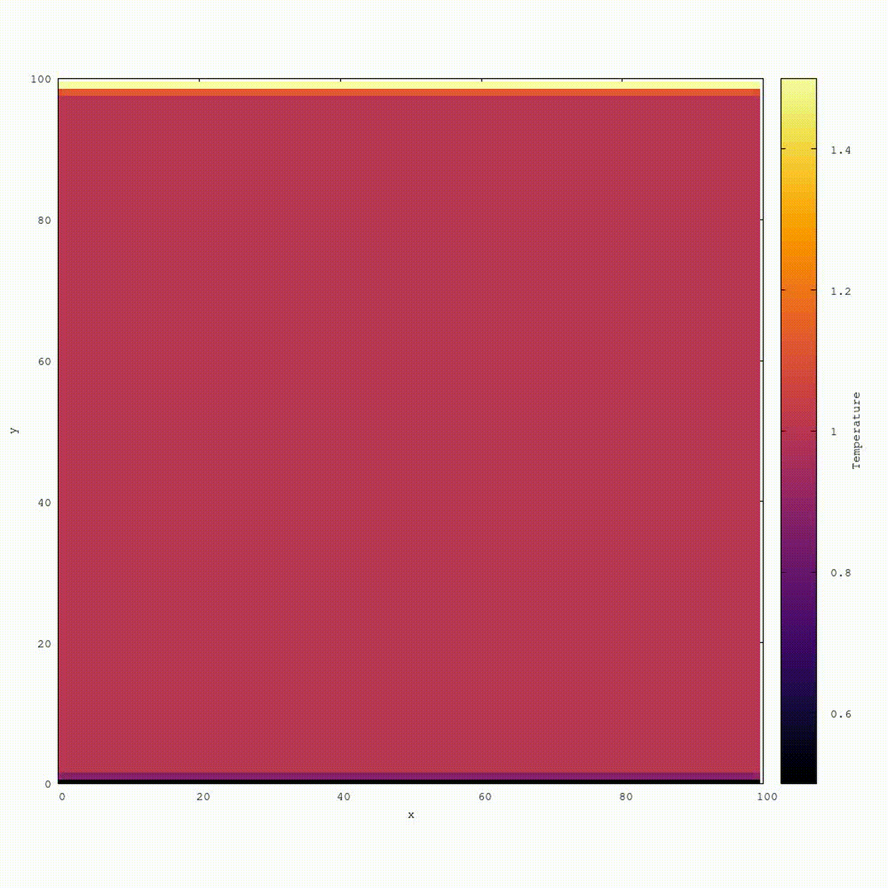

# Project Description

This is an original program being developed to simulate transport phenomena using the Lattice Boltzmann Method.

---

# Project Details

**Name**: Energy transfer in porous media flow: a study via Lattice Boltzmann simulations

**Advisor**: Prof. [Luís F. M. Franco](https://scholar.google.com/citations?user=bkPJh6sAAAAJ&hl=en)

**Location**: Universidade Estadual de Campinas, School of Chemical Engineering

**Funding**: São Paulo Research Foundation [FAPESP](https://fapesp.br/en)

## Associated Project (Research Internship Abroad)

**Name**: Rattle effect on flow and heat transfer within porous media: a study via Lattice Boltzmann simulations

**Advisors**: Prof. [Benoit Coasne](https://scholar.google.com/citations?user=-rO1SkUAAAAJ&hl=en) (France)  Prof. [Luís F. M. Franco](https://scholar.google.com/citations?user=bkPJh6sAAAAJ&hl=en) (Brazil)

**Location**: Université Grenoble Alpes, LIPhy (visiting research internship)

**Funding**: São Paulo Research Foundation [FAPESP](https://fapesp.br/en)

---

# Some Simulations

#### **Rattle Effect Impact in** ***Temperature*** **in a lattice with particles**

*x,y: position* 

*color: temperature*

#### **Adsorption in a lattice with particles**

*x,y: position*

*color: concentration*

#### **Linear** ***Temperature Gradient*** **between hot and cold**

*x,y: position*

*color: temperature*